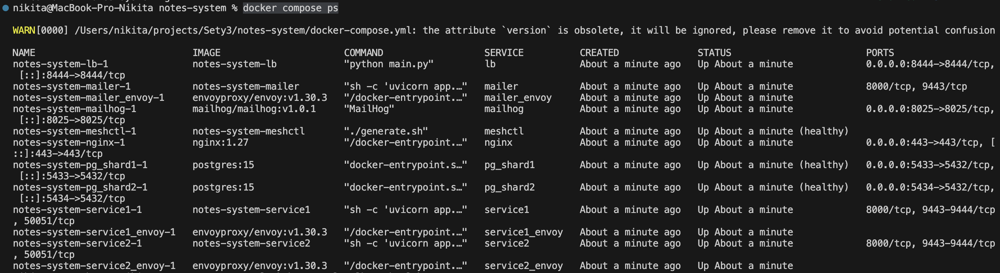
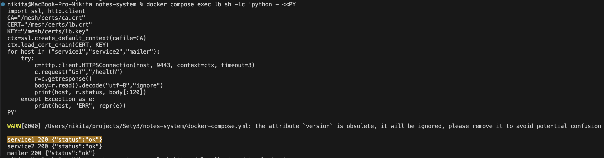
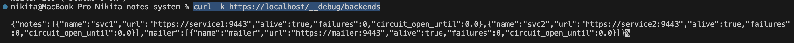
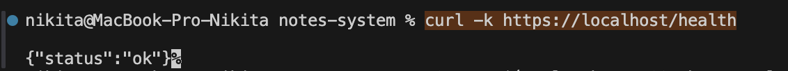
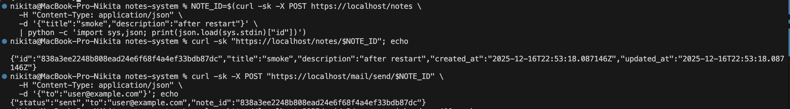
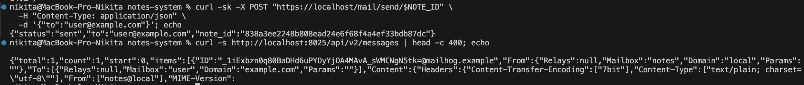
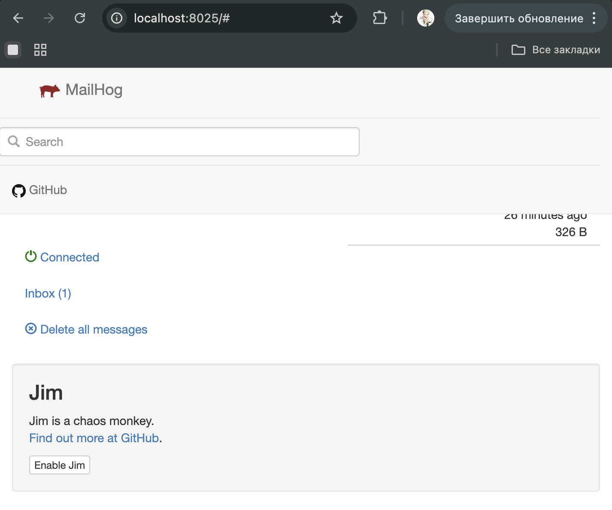

# Sety3

Service Mesh для notes-system + mailer + HTTPS-everywhere

## 1. Суть задания

Реализовано:

- Service mesh / mTLS внутри сети: все межсервисные запросы идут по HTTPS с взаимной аутентификацией сертификатами (mTLS).
- Добавлен микросервис mailer, который по запросу отправляет заметку на email.
- HTTPS-everywhere без изменения notes-сервиса: сами service1/service2/mailer слушают HTTP внутри контейнера, а HTTPS обеспечивается через Envoy sidecar + внешний Nginx.
- Генерация сертификатов и envoy-конфигов вынесена в отдельный сервис meshctl.

---

## 3. Архитектура сетевого взаимодействия

### 3.1 Внешний вход

Клиент → https://localhost/* → nginx (443) → lb (8443, HTTPS) → дальше по сервисам.

### 3.2 Внутренний mesh (mTLS)

- lb → service1_envoy/service2_envoy/mailer_envoy: https://serviceX:9443 с mTLS
- mailer → notes backends: https://service1:9443, https://service2:9443 с mTLS

Каждый Envoy принимает HTTPS на 9443/9444, проверяет клиентский сертификат и проксирует в локальный HTTP (127.0.0.1:8000 / 127.0.0.1:50051).

---

## 4. Запуск

4.1 Сборка и поднятие

```bash
docker compose up -d --build
```

Скрин 1 - docker compose ps после старта.


---

## 5. Проверка mesh (mTLS внутри сети)

### 5.1 Проверка изнутри LB, что mTLS работает и Envoy слушает 9443

```bash
docker compose exec lb sh -lc 'python - <<PY
import ssl, http.client
CA="/mesh/certs/ca.crt"
CERT="/mesh/certs/lb.crt"
KEY="/mesh/certs/lb.key"
ctx=ssl.create_default_context(cafile=CA)
ctx.load_cert_chain(CERT, KEY)
for host in ("service1","service2","mailer"):
    try:
        c=http.client.HTTPSConnection(host, 9443, context=ctx, timeout=3)
        c.request("GET","/health")
        r=c.getresponse()
        body=r.read().decode("utf-8","ignore")
        print(host, r.status, body[:120])
    except Exception as e:
        print(host, "ERR", repr(e))
PY'
```

Получен результат: 200 {"status":"ok"} для всех.

Скрин 2.


---

## 6. Проверка внешнего HTTPS (через Nginx)

### 6.1 Debug backends (видно, что LB считает сервисы живыми)

```bash
curl -k https://localhost/__debug/backends
```

Получен результат: alive: true у svc1, svc2, mailer.

Скрин 3.


### 6.2 Health

```bash
curl -k https://localhost/health
```

Получен результат: {"status":"ok"}

Скрин 4.


---

## 7. REST smoke тест для notes

### 7.1 Создать заметку и сразу получить её по id

```bash
NOTE_ID=$(curl -sk -X POST https://localhost/notes \
  -H "Content-Type: application/json" \
  -d '{"title":"smoke","description":"after restart"}' \
  | python -c 'import sys,json; print(json.load(sys.stdin)["id"])')

curl -sk "https://localhost/notes/$NOTE_ID"; echo
```

Скрин 5.


---

## 8. Отправка заметки по почте (mailer)

### 8.1 Отправить заметку на email

```bash
curl -sk -X POST "https://localhost/mail/send/$NOTE_ID" \
  -H "Content-Type: application/json" \
  -d '{"to":"user@example.com"}'; echo
```

Получен результат: {"status":"sent","to":"user@example.com","note_id":"..."}

Скрин 6.


### 8.2 Проверка письма в MailHog

Открыть в браузере: 
> http://localhost:8025/

В Inbox должно быть письмо, в теле - поля заметки.

Скрин 7.


```bash
curl -s http://localhost:8025/api/v2/messages | head -c 400; echo
```
